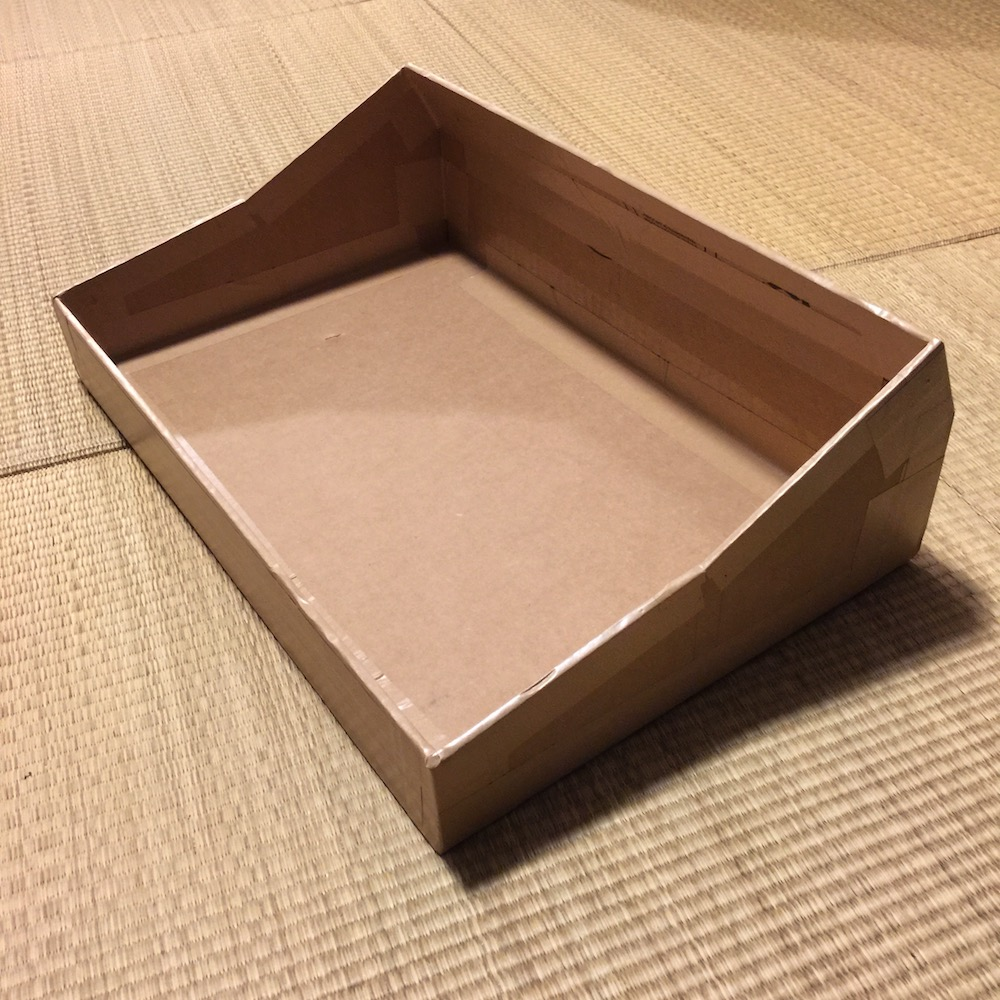

# DIY Eurorack Case Planner Tool
This is a simple one-page HTML app for messing around with planning how to build a DIY (cardboard) eurorack case. My original intent was just to create a tool that would allow me to visualize the angle for a 6U system case and gauge what amount of deskspace (and airspace) it would consume.

It is loosely based on the [Future Music guide for how to build your own cardboard eurorack modular case](http://www.musicradar.com/tuition/tech/how-to-build-your-own-cardboard-eurorack-modular-case-625196) and the accompanying PDF [CardboardCaseGuide](http://cdn.mos.musicradar.com/images/aaaroot/tech/7july15/DIY-Eurorack-case/CardboardCaseGuide.zip). 

This currently only shows the measurements for the side view of the case. Dotted lines show the outlines of the material used on the bottom of the case as well as the front and back of the case to show overlap -- by default this material thickness is based on the Future Music guide's 5mm cardboard thickness.

## Parameters

There are several adjustable parameters in the planner. 

The module depth max signifies the deepest module you wish to support in the case, which is set by default to 55mm. Note the "calculate needed rise" checkbox -- if checked, this calculates the necessary rise at the front of the case to accomodate the module depth. Since there is a slight (or unslight) angle for the first row of modules, the full module depth may not be needed. (if your first angle is 30 degrees, 47.6mm is sufficient for 55mm clearance)

Row 1 and 2 angles designate the angles at which the modules will sit. Note that row 2 angle is added to row 1, so it is really the differential to row 1.

Material thickness is set by default to 5mm -- this indicates the thickness of the cardboard (or whatever material) is used for the case. 5mm cardboard was used in Future Music's guide.

Pixels per cm -- this for now is my poor man's way of allowing the user to make the printed image of the case plan larger on the screen. I may remove this at a later date and just try to calculate the best guess at the sizing of the plan on the page to accomodate changes in window size.

## WARNING! DISCLAIMER! HEY! READ THIS!
**Disclaimer: ~~I have not yet actually built a case from this planner. I put the planner together in order to help me build one! (will post update once I've successfully completed one (or someone else does ;-))**~~

## Finished build

The two photos below are of the first case I built from cardboard using the planner as a guide (and also the full bottom width measurement from the FM guide). The angles used were 10 and 15 degrees (where the 15 degree is from the 10 degree line, so actually 25 degrees). This uses 2 pair of Tiptop Audio Z-Rails, 84hp, and a Tiptop uZeus for power.

## Allons-y!
Go to [the planner](https://intafon.github.io/diyEurorackCasePlanner/planner.html).
